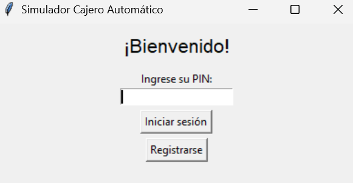
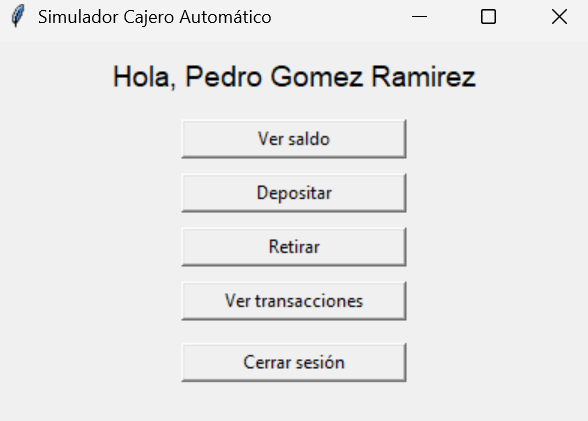

# ATM Simulator – Graphical Interface

This project is an ATM simulator developed in Python, featuring a graphical interface built using the standard Tkinter library. It was created as a personal exercise to practice and demonstrate programming skills, persistent data handling, and interface design.

The simulator allows users to register, log in using a PIN, check their balance, make deposits and withdrawals, and view a transaction history.

|  |  |
|:--:|:--:|


## Main Features

- User registration

- PIN login

- Balance inquiry

- Deposits and withdrawals

- Transaction history

- Tkinter interface

- Data persistence (`users.json`)

**Note:** The files data/users.json and data/transactions.log are ignored in the repository for privacy and security reasons:

- users.json stores sensitive user data (names, PINs, balances).

- transactions.log contains detailed user transaction history.

Both files will be automatically created by the program if they do not exist.
You can use the included data/users_example.json as a reference to understand the expected data structure.

## Installation

1. Clone this repository:
   ```bash
   git clone https://github.com/tuusuario/proyecto.git
   cd proyecto
   ```

2. Run the main file:
   ```bash
   python main.py
   ```

3. Ensure you have **Python 3.x** installed.

## Usage

1. Run `main.py`

2. In the window, enter your PIN or register if you're new.

3. Use the available options to check your balance, make deposits, or withdraw money.

## Technologies Used

- Python 3.x

- Tkinter (GUI)

- JSON (data storage)

## Developer

This ATM simulator was created as a personal project to apply programming and interface development knowledge.  
It was developed independently with a focus on structured logic, clean design and data persistence.

**Author:** [Jian Elián Hernández](https://github.com/Portal-JianDev)

**Note:** This project was developed as a self-directed practice exercise. While effort has been made to ensure its correctness and usability, minor bugs may still exist. Improvements are made continuously as part of the learning process.

## License

This project is licensed under the MIT License. See the `LICENSE` file for more details.
